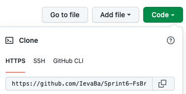

# Sprint 6 - File System Browser using PHP

## About

- Sprint 6 is a project i made while studying at BIT.
- It's a simple files manager with login form created with PHP.
- For the main styling i used raw CSS.

## Features

- In this File Browser System you can:
  - See all the files and directories in the current directory
  - Navigate through directories
  - Create new directories (except those with the same name)
  - Upload files (only JPG, PNG or PDF and not bigger than 3 MB)
  - Download files (unique names given)
  - Delete files (index.php, style.css, README.md files and icons are protected !)
- Implemented authentication: to access File System Browser, first you need to log in.

## Launch procedure

1. Install XAMPP (or other web server package).
2. Navigate to the directory where you want to have this project saved.
3. Clone my Github repository [Sprint6-FsBrowserPHP](https://github.com/IevaBa/Sprint6-FsBrowserPHP.git)

4. Open your terminal, type `git clone` , paste the URL you copied and press Enter to create your local clone.
5. Open cloned project in VScode.
6. Run XAMPP and start Apache Web Server.
7. Open your browser and in the search bar type:
   `localhost/FsBrowserPHP/`.
8. Login with username `Ieva` and password `1234`
9. Enjoy browsing !

## Author

This project was created by me - Ieva Baltriukaite.

Find me on [LinkedIn](https://www.linkedin.com/in/ieva-baltriukaite-59038755/)
